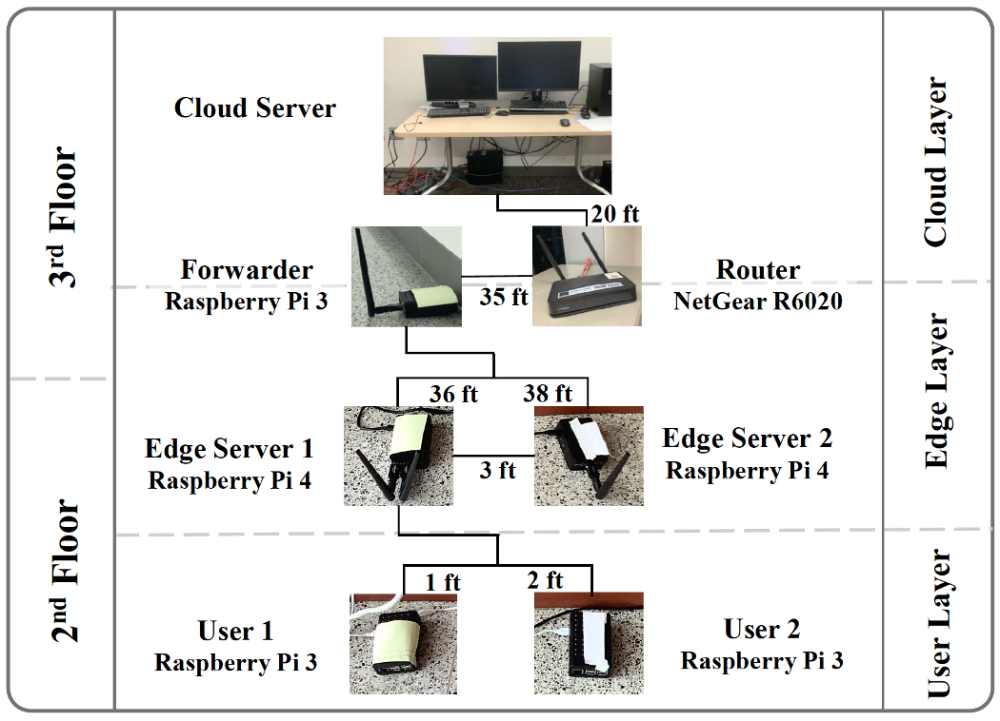

# Fed-MEC
This project is focused on the design, development, and deployment of federated solutions to problems in the framework of mobile edge computing.

***

In this repository, you can find source code related to the following papers:

* Hosseinzadeh, M. Wachal, A., Khamfroush, H., Lucani, D. E., "Optimal Accuracy-Time Trade-off For Deep Learning Services in Edge Computing Systems," IEEE ICCC, 2021.
  * Code can be found in `Distributed-Client-Selection-FL`.
  * To evaluate the proposed approach in this paper, we built a testbed in Marksburry building at Computer Science department at University of kentucky consisting of 2 Raspberry Pi4, 3 Raspberry Pi3, a NetGear router, and a Linux Desktop. The picture of the testbed is here: 
* Hudson, N., Khamfroush, H., Lucani, D. E., "QoS-Aware Placement of Deep Learning Services on the Edge with Multiple Service Implementations," IEEE ICCCN Workshops, 2021.
  * Code can be found in `PIES-Service-Placement-Code`.
  * Draft of the full manuscript can be found in `PIES_Service_Placement`.

